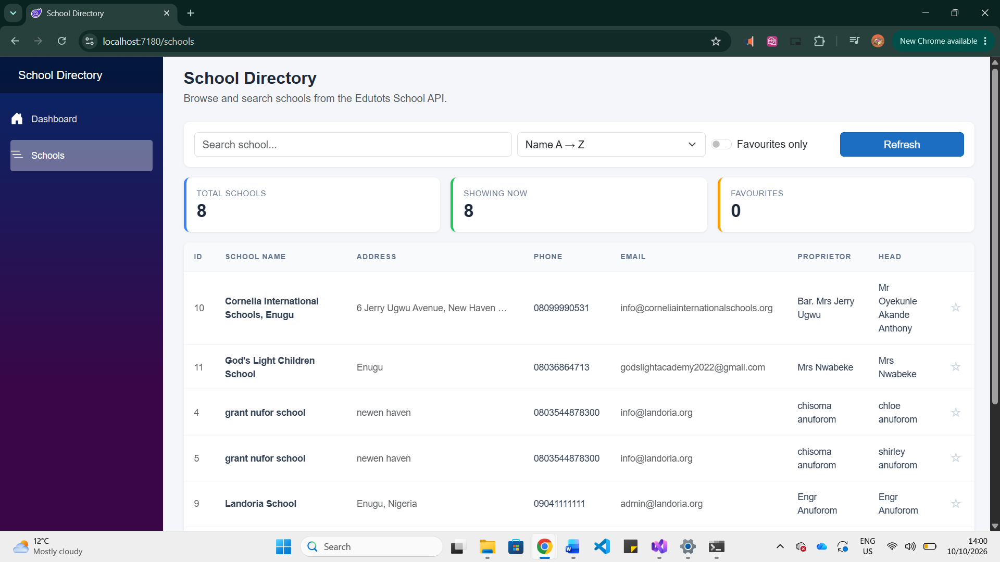
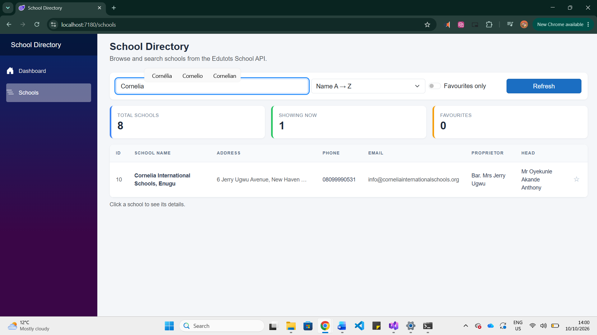
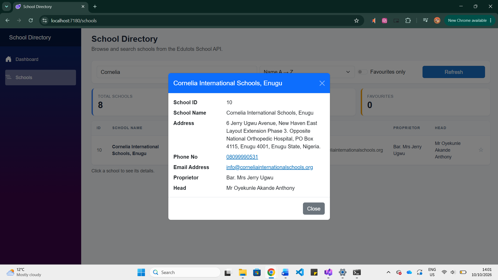
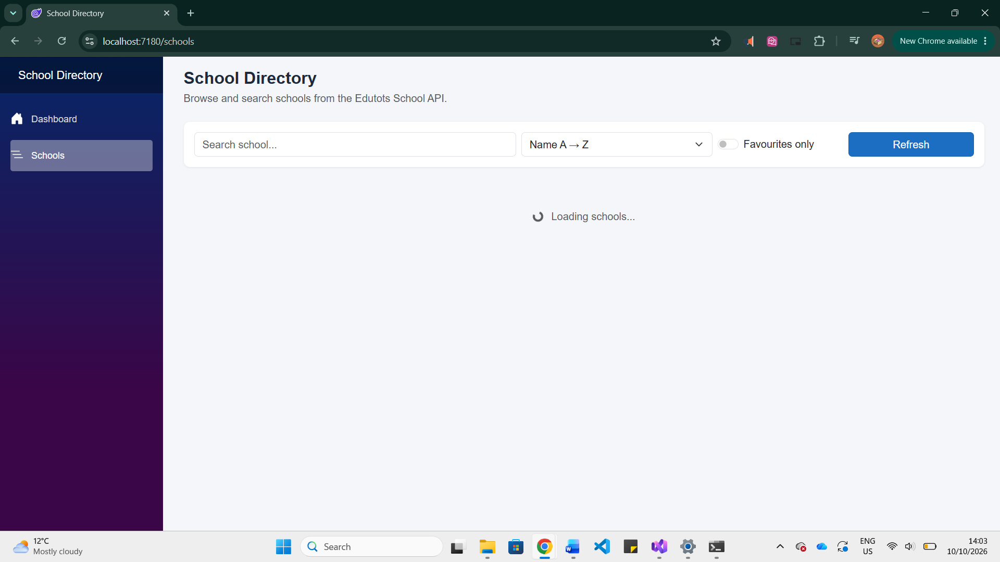
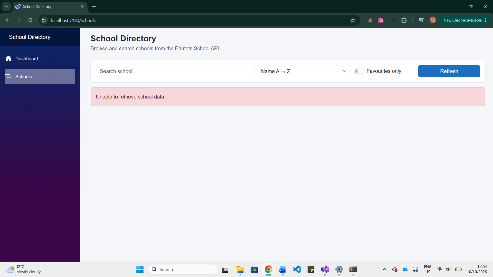
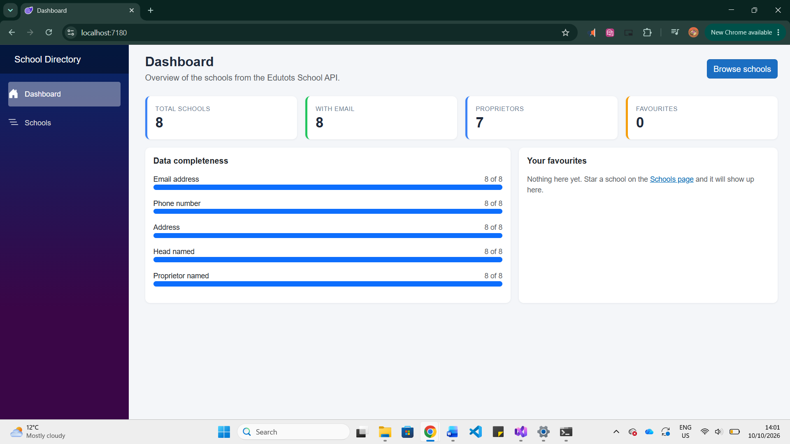
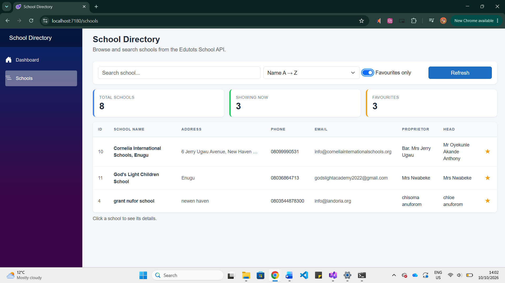

# School Directory Dashboard

[](https://github.com/Luarafroes/SchoolDirectoryApp/actions/workflows/main.yml)

## Project Description
A Blazor web application that retrieves school data from the Edutots School API and
presents it in a clean, interactive directory. Users can search schools by name, sort the
list, mark favourites, open a details pop-up for any school, and see an overview dashboard
on the home page. The app shows clear loading and error messages while talking to the API.

## Features
- Fetches school data from the Edutots School API using `HttpClient`
- Searchable table of schools (filters as you type)
- Reusable `SchoolCard` component (one table row) using `[Parameter]` and `EventCallback`
- School details pop-up using a second component, `SchoolDetails`
- Loading message while data is being retrieved
- Error message if the API call fails
- Sort schools A–Z or Z–A
- Favourite schools (★) with a "Favourites only" filter, shared between pages through a `FavouritesService`
- Refresh button
- Dashboard home page with statistics, a data completeness chart and favourites
- Responsive Bootstrap layout
- Automated build with GitHub Actions

## Technologies Used
- C# and .NET [your version, e.g. 9.0]
- Blazor Web App (Interactive Server mode)
- Bootstrap
- GitHub Actions
- Visual Studio Code
- Git and GitHub

## API Endpoint Used
`GET https://edutots.net/api/school`

## Project Structure
```
SchoolDirectoryApp
├── .github
│   └── workflows
│       └── main.yml
├── Models
│   └── School.cs
├── Services
│   ├── SchoolService.cs
│   └── FavouritesService.cs
├── Components
│   ├── SchoolCard.razor
│   ├── SchoolDetails.razor
│   ├── Layout
│   │   ├── MainLayout.razor
│   │   └── NavMenu.razor
│   └── Pages
│       ├── Home.razor
│       └── Schools.razor
├── screenshots
└── Program.cs
```

## How It Works
- `SchoolService` calls the API with `HttpClient` and turns the JSON into a list of `School` objects.
- `Schools.razor` loads the list, handles search, sorting, loading and error states, and shows the table.
- `SchoolCard` is one table row. It receives a school through `[Parameter]` and tells the page when it is clicked using `EventCallback<School> OnSelect`.
- `SchoolDetails` is the pop-up that shows the full details of the selected school.
- `FavouritesService` remembers the favourite schools so the Schools page and the Dashboard share them.
- `Home.razor` is the dashboard. It calculates its statistics from the same API data.

## How to Run the Application
1. Install the [.NET SDK](https://dotnet.microsoft.com/download).
2. Clone the repository:
   `git clone https://github.com/Luarafroes/SchoolDirectoryApp.git`
3. Open the folder in Visual Studio Code.
4. Press `F5` to run (or run `dotnet run` in a terminal).
5. The app opens in your browser. Use the menu to switch between **Dashboard** and **Schools**.

## Continuous Integration
This repository uses a GitHub Actions workflow, **Build Blazor Application**
(`.github/workflows/main.yml`), that runs automatically when code is pushed to the repository.
It builds the Blazor project to check that the code compiles. The badge at the top of this
README shows whether the latest run passed.

## Screenshots

### School list loaded


### Search functionality


### School details view


### Loading state


### Error state


### Dashboard


### Favourites


## Notes
- Favourites are kept for the current browser session and reset when the page is fully refreshed.

## Author
[Your name]
